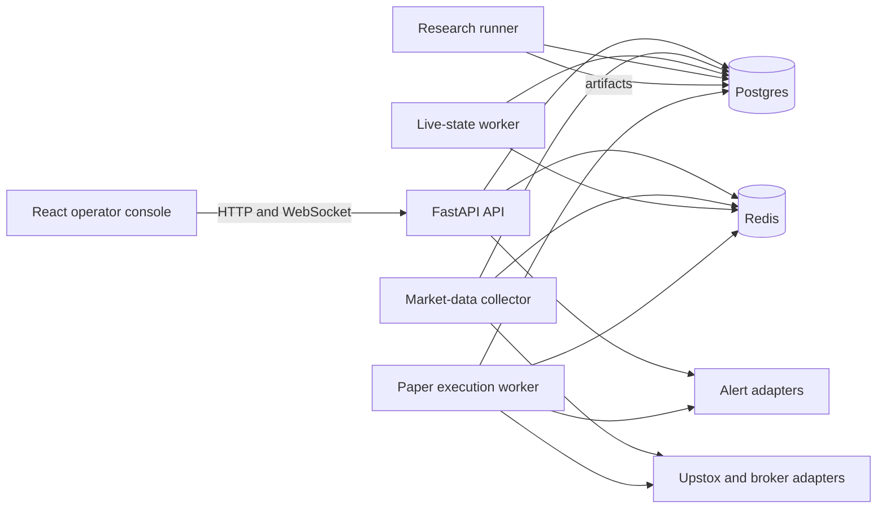
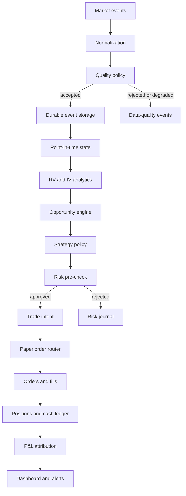

# System Design

## Architectural style

The MVP is a modular monolith with separately runnable processes. Domain boundaries are explicit in code, while deployment remains simple enough for one machine and one operator.

Do not create independently deployed microservices until load, reliability, ownership, or scaling requirements justify them.

## System planes

### Research plane

Owns datasets, estimators, forecasts, simulations, backtests, artifacts, experiment manifests, and model comparison.

### Market-state plane

Owns instruments, sessions, quotes, trades, chain snapshots, data-quality events, Greeks, IV surfaces, and current market state.

### Strategy and risk plane

Owns strategy configuration, entry candidates, opportunity scores, hedge decisions, risk decisions, and kill-switch state.

### Execution plane

Owns paper orders, broker-shaped order state, fills, positions, cash ledger entries, reconciliation, and end-of-day controls.

### Observability plane

Owns structured logs, metrics, traces, alerts, immutable decision journals, and operator dashboards.

## Runtime topology



## Planned code boundaries

```text
backend/app/
├── api/
├── core/
├── auth/
├── market_data/
├── instruments/
├── volatility/
├── options/
├── surfaces/
├── opportunities/
├── simulation/
├── hedging/
├── strategies/
├── portfolio/
├── execution/
├── risk/
├── reconciliation/
├── observability/
├── schemas/
├── services/
└── cli/

frontend/src/
├── app/
├── features/
├── pages/
├── shared/
│   ├── api/
│   ├── components/
│   ├── hooks/
│   ├── formatting/
│   └── types/
└── store/
```

The existing RV implementation may remain under `quant/` during migration. New domain work should use the target boundaries rather than expanding a generic `quant` package indefinitely.

## Dependency direction

```text
API and CLI
    ↓
Application services
    ↓
Domain policies and analytics
    ↓
Ports and repositories
    ↓
Infrastructure adapters
```

Rules:

- Domain modules do not import FastAPI, broker SDKs, database sessions, Redis clients, or UI contracts.
- API routers validate transport input and call application services.
- Application services coordinate repositories, domain calculations, and policies.
- Infrastructure implements ports for databases, broker APIs, files, Redis, and alerts.
- Pydantic transport schemas are not the durable domain model by default.
- Research calculations are pure functions wherever practical.
- Execution and risk decisions are deterministic for a given state and policy version.

## Primary data flow



## Source-of-truth rules

- Postgres is the durable source of truth for instruments, quotes retained for replay, strategy runs, intents, orders, fills, positions, ledgers, reconciliation, and risk events.
- Immutable research artifacts remain content-addressed files initially and may later be registered in Postgres or object storage.
- Redis is an acceleration and coordination layer, never the only copy of durable trading state.
- The broker is authoritative for broker-acknowledged order and position state once broker integration exists.
- Internal state is reconciled against the broker; it is never assumed correct merely because an order request succeeded.

## State ownership

| State | Owner | Durable | Redis eligible |
|---|---|---:|---:|
| Instrument catalogue | Postgres | Yes | Latest lookup cache |
| Historical quotes | Postgres | Yes | No |
| Latest quotes | Market-state worker | Snapshot and event history | Yes |
| IV surface snapshot | Surface engine | Selected snapshots | Yes |
| Strategy configuration | Postgres and version control | Yes | Read cache |
| Trade intents | Postgres | Yes | Notification only |
| Orders and fills | Postgres and broker | Yes | Latest-state cache |
| Positions and cash ledger | Postgres | Yes | Latest-state cache |
| Kill switch | Postgres with Redis mirror | Yes | Yes |
| UI query cache | RTK Query | No | Browser only |

## Safety boundary

The MVP ends at paper execution. Broker authentication and market-data access do not imply permission to place live-capital orders. A live order adapter must remain absent or disabled by construction until a separate approval and acceptance process exists.
