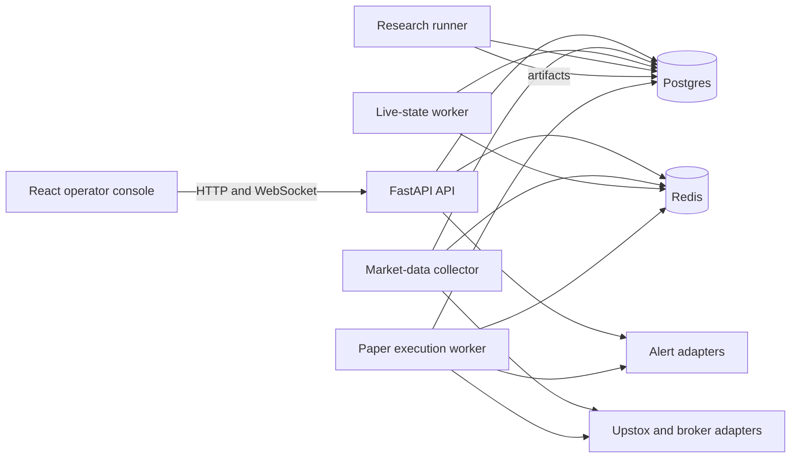
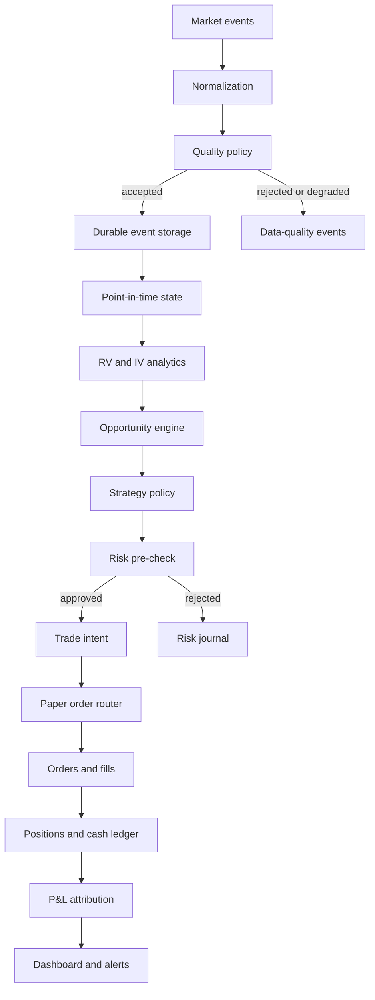

# System Design

## Architectural style

The MVP is a modular monolith with separately runnable processes. Domain boundaries are explicit in code, while deployment remains simple enough for one machine and one operator.

Do not create independently deployed microservices until load, reliability, ownership, or scaling requirements justify them.

## System planes

### Research plane

Owns datasets, estimators, forecasts, simulations, backtests, artifacts, experiment manifests, and model comparison.

### Market-state plane

Owns instruments, sessions, quotes, trades, chain snapshots, data-quality events, Greeks, IV surfaces, and current market state.

### Strategy and risk plane

Owns strategy configuration, entry candidates, opportunity scores, hedge decisions, risk decisions, and kill-switch state.

### Execution plane

Owns paper orders, broker-shaped order state, fills, positions, cash ledger entries, reconciliation, and end-of-day controls.

### Observability plane

Owns structured logs, metrics, traces, alerts, immutable decision journals, and operator dashboards.

## Runtime topology



## Planned code boundaries

```text
backend/app/
├── api/
├── core/
├── auth/
├── market_data/
├── instruments/
├── volatility/
├── options/
├── surfaces/
├── opportunities/
├── simulation/
├── hedging/
├── strategies/
├── portfolio/
├── execution/
├── risk/
├── reconciliation/
├── observability/
├── schemas/
├── services/
└── cli/

frontend/src/
├── app/
├── features/
├── pages/
├── shared/
│   ├── api/
│   ├── components/
│   ├── hooks/
│   ├── formatting/
│   └── types/
└── store/
```

The existing RV implementation may remain under `quant/` during migration. New domain work should use the target boundaries rather than expanding a generic `quant` package indefinitely.

STRAT-1 and SIM-1 implement the target `strategy`, `options`, `simulation`, `portfolio`, `hedging`, `execution`, and `attribution` boundaries as an offline deterministic research slice. These modules have no FastAPI, broker, Redis, or database dependencies. The simulation CLI coordinates pure analytics and publishes immutable local artifacts.

DATA-1.0 adds persistence-independent domain types under `instruments` and `market_data`. `core.hashing` owns the canonical serializer and SHA-256 helper shared with simulation. DATA-1.1 adds persistence-independent catalogue, trading-session, repository, and unit-of-work contracts under `instruments`, with SQLAlchemy and asyncpg implementations isolated under `persistence.postgres`. Catalogue ingestion remains a later DATA-1 slice.

## Dependency direction

```text
API and CLI
    ↓
Application services
    ↓
Domain policies and analytics
    ↓
Ports and repositories
    ↓
Infrastructure adapters
```

Rules:

- Domain modules do not import FastAPI, broker SDKs, database sessions, Redis clients, or UI contracts.
- API routers validate transport input and call application services.
- Application services coordinate repositories, domain calculations, and policies.
- Infrastructure implements ports for databases, broker APIs, files, Redis, and alerts.
- Pydantic transport schemas are not the durable domain model by default.
- Research calculations are pure functions wherever practical.
- Execution and risk decisions are deterministic for a given state and policy version.
- Economic instrument identity is provider-neutral. Validity-bounded contract versions and provider mappings reference it instead of redefining it.

## Primary data flow



## Source-of-truth rules

- Postgres is the durable source of truth for instruments, quotes retained for replay, strategy runs, intents, orders, fills, positions, ledgers, reconciliation, and risk events.
- Immutable research artifacts remain content-addressed files initially and may later be registered in Postgres or object storage.
- Redis is an acceleration and coordination layer, never the only copy of durable trading state.
- The broker is authoritative for broker-acknowledged order and position state once broker integration exists.
- Internal state is reconciled against the broker; it is never assumed correct merely because an order request succeeded.

## Point-in-time state semantics

DATA-1 uses bitemporal selection rather than one overloaded `as_of` timestamp:

```text
exchange_timestamp ≤ market_as_of
available_at ≤ known_as_of
recorded_at and append-only successor edges bound system visibility
```

`market_as_of` represents market effective time. `known_as_of` represents the information QuantKYND could use at a decision. Catalogue versions and provider mappings must pass both their effective-time and system-time intervals. Event corrections and quality re-evaluations append new records, so an earlier knowledge cutoff continues to reproduce the earlier result.

Historical imports without defensible dissemination or receipt timestamps carry an explicit non-defensible availability basis. They may support market-time analysis, but do not silently satisfy a knowledge-time replay claim.

Point-in-time reconstruction fails closed on structurally invalid inputs. Semantic version, provider-mapping, and normalized-event indexes reject conflicting records that share an ID. Correction edges are resolved only after their targets, economic contracts, event types, acyclic structure, and single-successor branches are validated. Representation validity preserves finite zero-price observations; a versioned quality assessment, not normalization, determines chain eligibility.

## DATA-1.1 persistence boundary

Postgres becomes durable truth only for the DATA-1.1 catalogue, instrument identity/version, provider-mapping, and trading-session records actually represented by the initial migration. Quote, trade, quality, chain, analytics, strategy, order, and ledger persistence remain deferred. Offline research and simulation do not construct a database engine and do not require database configuration.

The infrastructure layer owns one lazy async engine factory, one SQLAlchemy metadata registry, explicit domain/row mappings, async repository adapters, and the Postgres unit of work. Each unit of work creates exactly one `AsyncSession` and one repeatable-read transaction snapshot. Repository calls never commit. Commit, rollback, or failed commit finalizes the unit; exit without commit rolls back; context exit closes the session. Immutable insertion uses the deterministic key as the conflict target, treats a complete-record repeat as idempotent, and raises a semantic collision when any durable field differs.

Revision `20260804_02` separates semantic tables from immutable catalogue, instrument-version, provider-mapping, and session-version temporal record tables. Each record has a deterministic record ID, knowledge timestamp, scope, provenance, and optional self-table predecessor reference. A partial unique index permits at most one direct successor. Repositories lock the predecessor before validating existence, scope, strict time ordering, and successor absence. Read paths defensively reject missing targets, cross-scope edges, non-increasing time, branches, and cycles.

DATA-1.2 adds an offline provider-catalogue ingestion boundary for the approved `upstox-nse-nifty-index-derivatives-v1` profile. It accepts only a local official Upstox BOD NSE `NSE.json.gz` artifact, streams and validates one UTF-8 JSON array, retains exact compressed bytes in a content-addressed artifact store on commit, and persists accepted catalogue provenance through Postgres in one transaction. The provider adapter maps only the declared Nifty 50 index, `NSE_FO` futures, and `NSE_FO` call/put option rows whose `underlying_key` resolves to `NSE_INDEX|Nifty 50`; unrelated rows are recorded as `excluded_by_profile`.

The DATA-1.2 service owns parsing, profile normalization, in-artifact conflict checks, artifact retention, repository-aware dry-run checks, and commit orchestration. Domain and parser modules remain persistence-independent. PostgreSQL adapters add only ingestion provenance, row outcomes, and catalogue memberships; DATA-1.1 catalogue, instrument, version, provider-mapping, and temporal-record repositories remain the durable market-state writers. Commit mode acquires a transaction-scoped advisory lock keyed by provider and profile before reading predecessor state or inserting catalogue records.

Sequential ingestion uses one repository-aware transition plan in dry-run and commit. Planning resolves the current unsuperseded knowledge leaf without filtering by the incoming market time. It validates the complete visible catalogue, instrument-version, and provider-mapping graphs and fails closed on missing targets, multiple roots or leaves, branches, cycles, and cross-scope edges. Every non-root catalogue must explicitly name the current catalogue knowledge leaf; every new version or mapping for an existing scope supersedes its current knowledge leaf. A provider key can continue to identify the same economic instrument across provenance-bound versions, but any historical binding to another economic instrument rejects the catalogue. Disappeared memberships are diff output only and do not close or supersede their instrument or mapping histories.

Invocation time and durable knowledge time are separate. `started_at` is captured before parsing. Commit mode retains the validated artifact, acquires the provider/profile advisory lock, checks idempotency, and captures one accepted write timestamp immediately before transition planning. A pure rebind materializes every catalogue, instrument-version, and provider-mapping knowledge record at that timestamp without changing semantic IDs; temporal record IDs represent the rebound durable records. Validate-only and dry-run have no durable knowledge timestamp. Accepted runs enforce `started_at <= recorded_at <= completed_at`.

Dry-run executes the same plan in one read-only repeatable-read transaction and returns added, unchanged, metadata-changed, provider-mapping-changed, disappeared, excluded, and exact-duplicate counts. Database failures are checked against accepted idempotency state only after rollback in a fresh transaction. Matching immutable commands return idempotent success; absent accepted state preserves the original semantic, temporal, integrity, or database error.

For a point-in-time query, one transaction snapshot supplies all committed rows. `known_as_of` filters record knowledge time when present; current reads use every row visible in that snapshot. The visible graph is validated before market eligibility is evaluated independently. Every market-eligible descendant suppresses all market-eligible ancestors in its visible supersession lineage, including through one or more market-ineligible intermediate records. Lineage order comes only from immutable supersession edges, never timestamp sorting. Zero eligible records means not found. Eligible records in separate roots, or multiple eligible records that cannot be ordered by the validated lineage, fail closed as ambiguous. This applies uniformly to catalogue, instrument-version, provider-mapping, and trading-session histories.

## State ownership

| State | Owner | Durable | Redis eligible |
|---|---|---:|---:|
| Instrument catalogue | Postgres | Yes | Latest lookup cache |
| Historical quotes | Postgres | Yes | No |
| Latest quotes | Market-state worker | Snapshot and event history | Yes |
| IV surface snapshot | Surface engine | Selected snapshots | Yes |
| Strategy configuration | Postgres and version control | Yes | Read cache |
| Trade intents | Postgres | Yes | Notification only |
| Orders and fills | Postgres and broker | Yes | Latest-state cache |
| Positions and cash ledger | Postgres | Yes | Latest-state cache |
| Kill switch | Postgres with Redis mirror | Yes | Yes |
| UI query cache | RTK Query | No | Browser only |

## Safety boundary

The MVP ends at paper execution. Broker authentication and market-data access do not imply permission to place live-capital orders. A live order adapter must remain absent or disabled by construction until a separate approval and acceptance process exists.

## LIVE-RV-1 read-only slice

LIVE-RV-1 uses one lazy `MarketDataStreamerV3` per backend process. Browser WebSockets terminate at FastAPI, and the in-memory coordinator reference-counts browser interest before changing upstream LTPC subscriptions. SDK callbacks cross into the FastAPI event loop with `call_soon_threadsafe`.

Finalized Upstox daily-close snapshots are immutable, bounded to 50 instruments, and cached for 15 minutes. The live quote store retains only the latest normalized state. It is an acceleration layer, not durable truth. An LTP may extend a finalized price series temporarily for the latest feature display, but never changes the finalized snapshot, forecast evaluation, persisted runs, or dataset identity.

LIVE-RV-1.1 assigns accepted-quote sequences in the coordinator independently per instrument. Normalization produces validated candidates without application sequence numbers. Each instrument subscription has one shared `subscribing`, `subscribed`, or `rejected` entry and readiness future, so concurrent browsers observe the same upstream result and failed entries leave no listeners behind. Selected-instrument status reads that instrument's entry; the status endpoint without an instrument retains aggregate operational status.

WebSocket authentication and exact instrument validation occur before acceptance. Upstream subscription and finalized-history loading occur after acceptance, and `market_state_snapshot` is always the first stream event. The stream concurrently observes browser disconnects and backend events, emits only changed status, coalesces quotes, and obtains refreshed finalized history through the registry with `resync_required` when the India exchange date changes. Provider errors are nonterminal while SDK auto-reconnect remains active: the retained quote becomes stale and the browser stream remains subscribed. Retry exhaustion is terminal, emits `provider_error`, and closes the browser stream with `1011`.

## DATA-1.3 deterministic market-event normalization

DATA-1.3 adds an offline, persistence-independent path from immutable Upstox V3 frame captures through a bounded vendored-Protobuf decoder to provider-neutral quote and market-status observations. Raw identity, explicit market/knowledge cutoffs, actual catalogue mapping/version/identity provenance, UTC availability, source order, union-scoped deferred declarations, and two deterministic hashes make every result reproducible. A PostgreSQL adapter resolves one sorted subject batch in one read-only repeatable-read unit of work; the decoder and pure normalizer do not import persistence.

Connection and subscription lifecycle observations are immutable offline contracts with closed transition sets, deterministic identities and instrument-key digests, controlled redacted reasons, and no provider-sequence claim. They are not wired into LIVE-RV. DATA-1.3 adds no event persistence, migration, Redis state, live subscription behavior, quality policy, analytics, or execution route.

Final-review hardening makes request mode, selected feed union, and subject kind one domain invariant rather than an adapter-only rule. Subscription key provenance is an immutable canonical set that derives its own count and digest, and request/acknowledgement modes use the provider mode enum. Source order increases only within one scope; an approved reconnect starts a new session and scope at any non-negative ordinal. Raw lifecycle batch validation rejects content collisions under one capture identity.

The repository resolver selects mapping eligibility independently before resolving the referenced contract-version graph. Mapping ambiguity and version ambiguity therefore remain distinct per-subject outcomes, allowing valid subjects in the same frame to proceed. Offline frame normalization owns the single decode and returns an optional response type; the CLI never performs a second decode.
